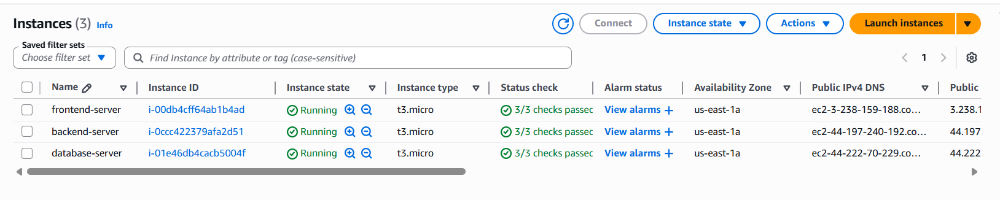
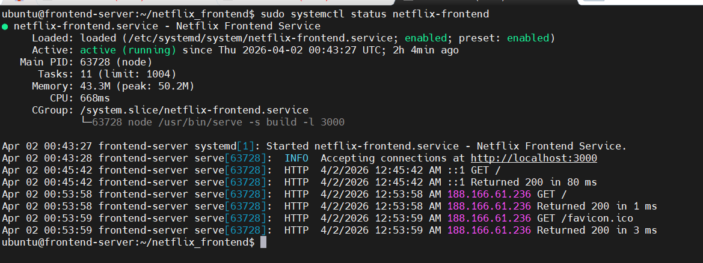

# Netflix Clone — 3-Tier AWS Deployment

Deployed a full-stack Netflix clone across three AWS EC2 instances using a 
manually provisioned 3-tier architecture. No managed services, no containers — 
every layer configured from scratch over SSH.

---

## Architecture
```
                    ┌─────────────────────────────────────┐
                    │           AWS EC2 (Ubuntu)           │
                    │                                      │
  Browser  ──────▶  │  React · serve · :3000  (Frontend)  │
                    │           │                          │
                    │           ▼                          │
                    │  Spring Boot · :8080  (Backend)      │
                    │           │                          │
                    │           ▼                          │
                    │  MongoDB 7.0 · :27017  (Database)    │
                    └─────────────────────────────────────┘
```

Three separate EC2 instances. Each server communicates over private IP within 
the same AWS security group.

---

## Stack

| Layer | Technology |
|---|---|
| Frontend | React, Axios, Node.js 20, serve |
| Backend | Java 17, Spring Boot, Maven |
| Database | MongoDB 7.0 |
| Infrastructure | AWS EC2, Ubuntu 22.04, t3.micro |
| Process management | systemd |

---

## What I Built

This was a full end-to-end manual deployment — no tutorials followed for the 
infrastructure layer. The coach provided the application code. Everything from 
server provisioning to production configuration was implemented independently.

**Infrastructure provisioned:**
- 3 EC2 instances with a shared security group and key pair
- MongoDB configured with authentication, remote access locked to backend IP
- Spring Boot packaged as a JAR and deployed with a systemd service
- React app compiled to a production build and served on port 3000
- Both application services managed by systemd for automatic restart on reboot

**Problems I diagnosed and fixed:**
- React build OOM crash on t3.micro — resolved by provisioning a 1GB swapfile
- Double `/api/api/` routing bug — traced to Axios baseURL misconfiguration
- MongoDB remote connection failure — caused by a typo in `mongod.conf` bindIp
- Spring Boot URI authentication failure — caused by special characters in password breaking the connection string

---

## Security Group Configuration

| Port | Protocol | Purpose |
|---|---|---|
| 22 | TCP | SSH access |
| 3000 | TCP | React frontend |
| 8080 | TCP | Spring Boot backend |
| 27017 | TCP | MongoDB (restrict to backend IP in production) |

---

## Running the Project

See individual repos for full setup:

- [netflix-backend](https://github.com/elizabeth-ikechukwu/netflix-backend)
- [netflix-frontend](https://github.com/elizabeth-ikechukwu/netflix-frontend)

---

## Screenshots



```
---

## Author

**Ikechukwu Elizabeth Nkwo**  
Cloud and DevOps Engineer — AWS · Linux · Infrastructure  
[LinkedIn](https://linkedin.com/in/uroko-elizabeth-) · [GitHub](https://github.com/elizabeth-ikechukwu)
